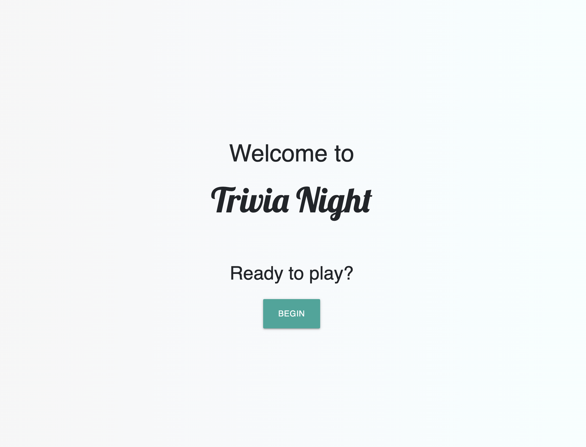
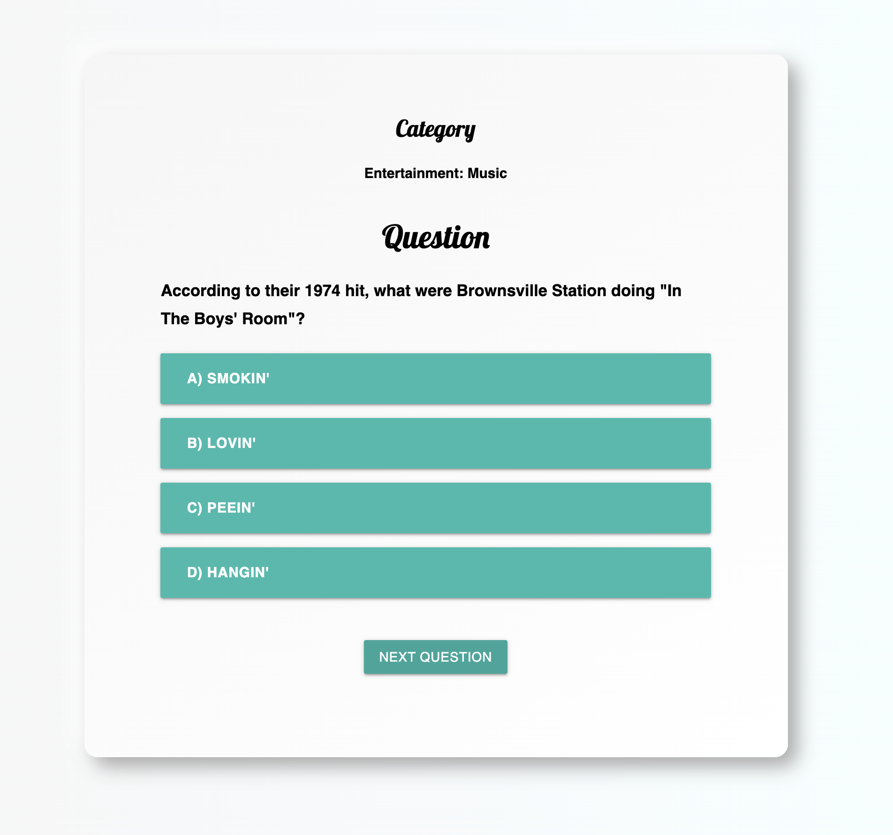
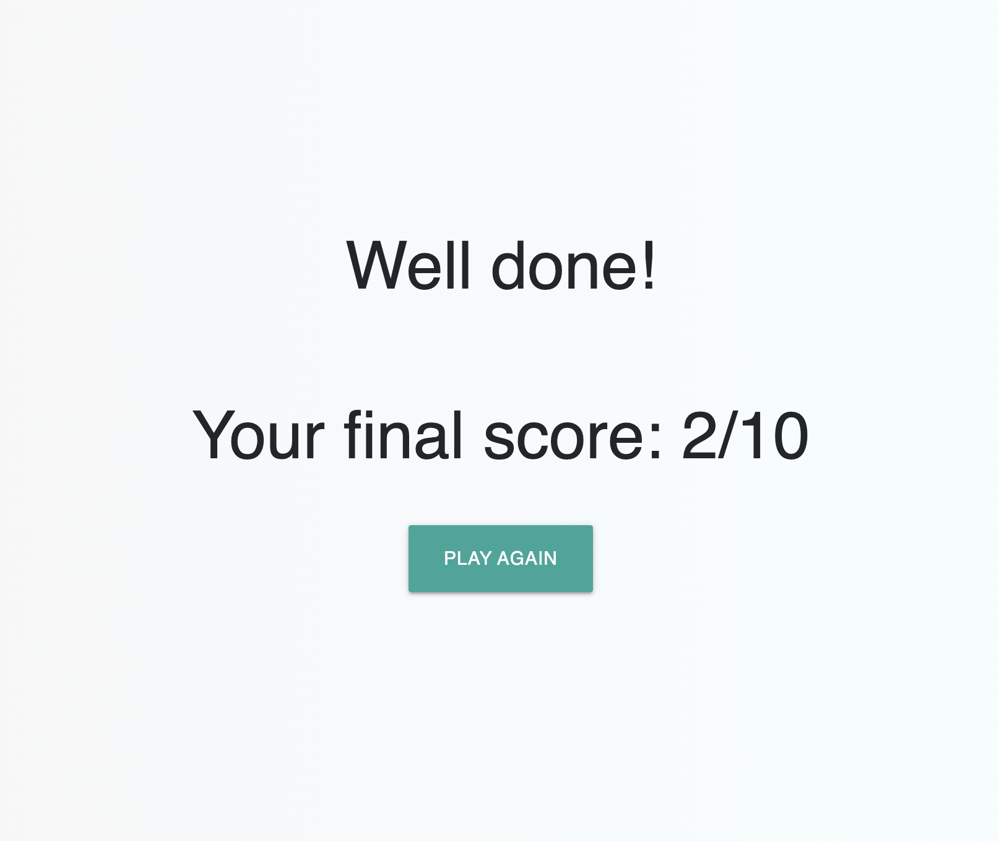

# Trivia Night

This is my project one for the SEIR Program.
Uses information from the Open Trivia Data base to generate 10 new multiple choice questions each time the game is played.

# Technologies Used

- HTML
- CSS
- JavaScript/jQuery

# Screenshots

# Getting Started

[click here](https://tylerrice121.github.io/Project-1---Trivia-Night/) to see the deployed project

# Future Enhancements
- Sound FX
- Images
- Giving the user more choices (difficulty, category, etc...)
