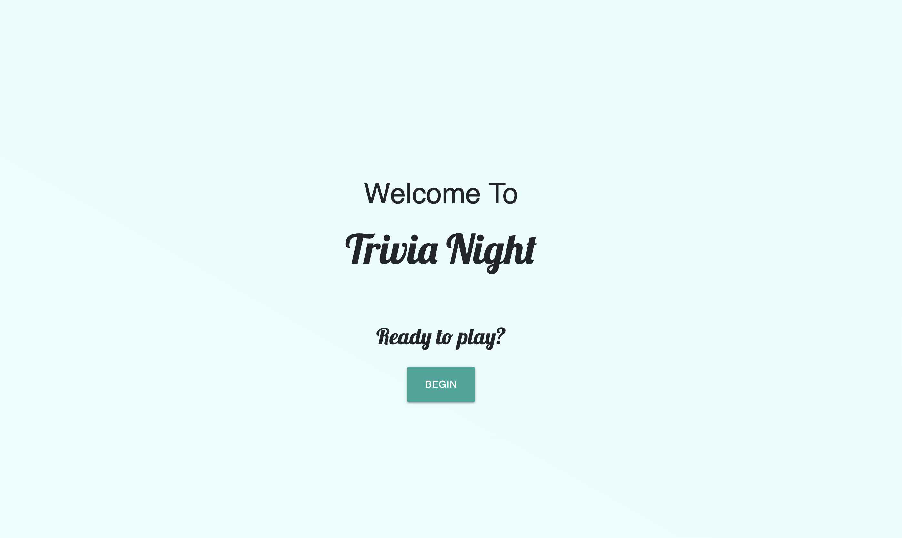
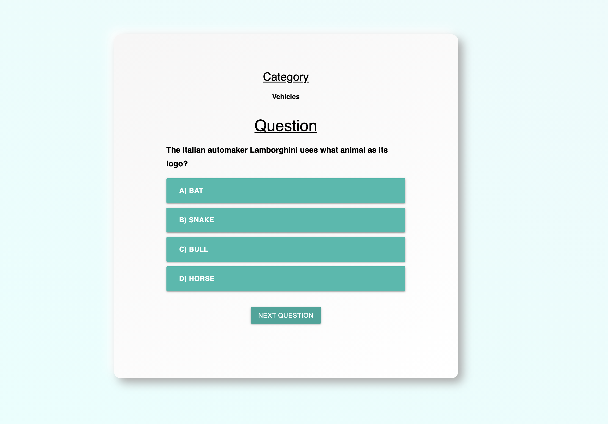
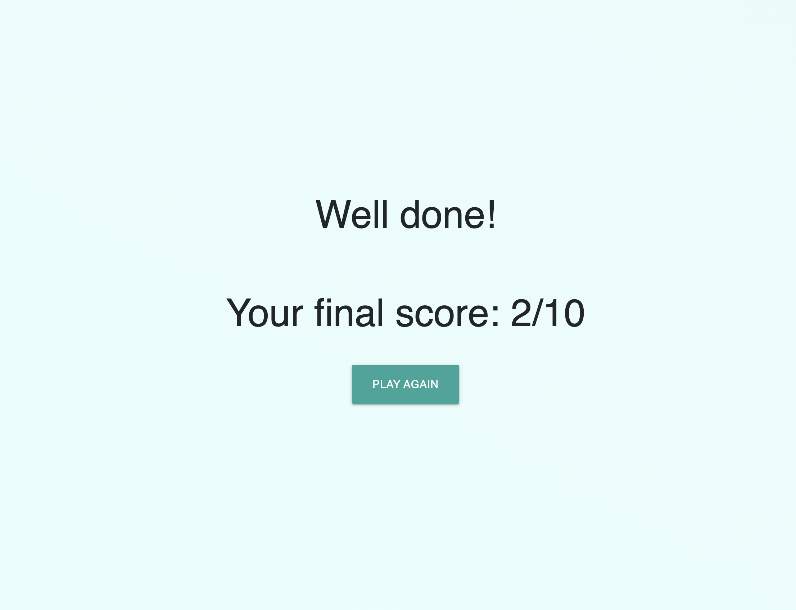

# Trivia Night

This is my project one for the SEIR Program

# Technologies Used

- HTML
- CSS
- JavaScript/jQuery

# Screenshots

# Getting Started

[click here](#) to see the deployed project

# Future Enhancements
- Sound FX
- Images
- Giving the user more choices (difficulty, category, etc...)